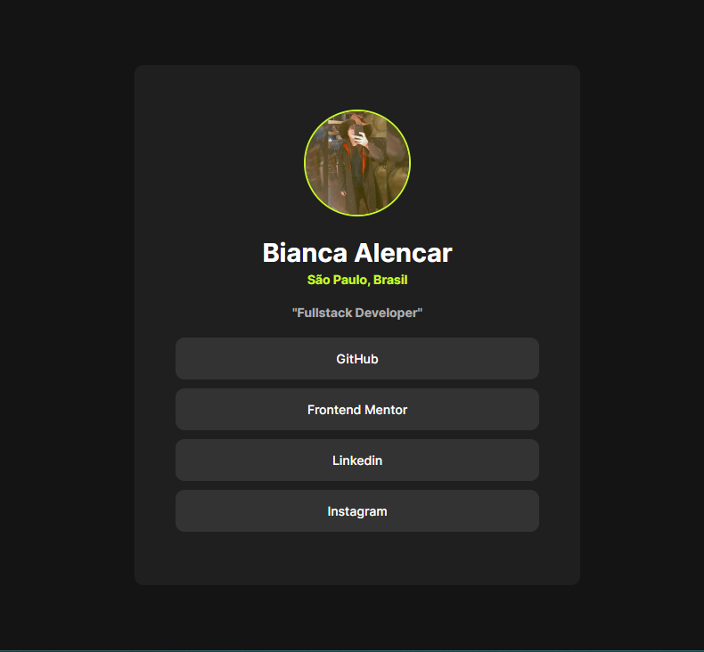

# Frontend Mentor - Social links profile



## Welcome! 👋

Thanks for checking out this front-end coding challenge.

[Frontend Mentor](https://www.frontendmentor.io) challenges help you improve your coding skills by building realistic projects.

**To do this challenge, you need a basic understanding of HTML and CSS.**

## 📦 Installation

Run to clone the project:

```bash
git clone https://github.com/Alencar-Bianca/social-links-profile
```
## 🚀 Technologies

This project is being developed with the following technologies:

 


## Deploying your project

- [GitHub Pages](https://alencar-bianca.github.io/social-links-profile/)

